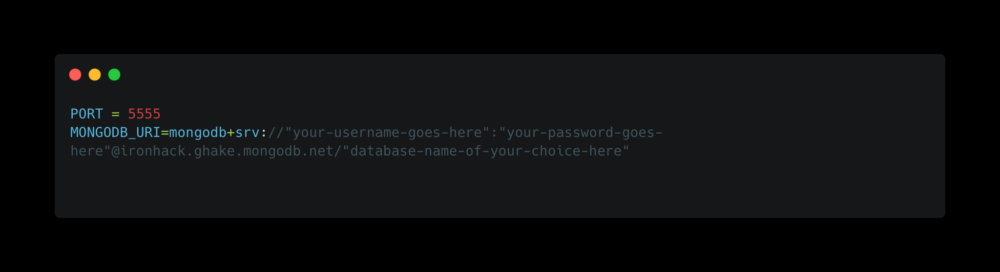
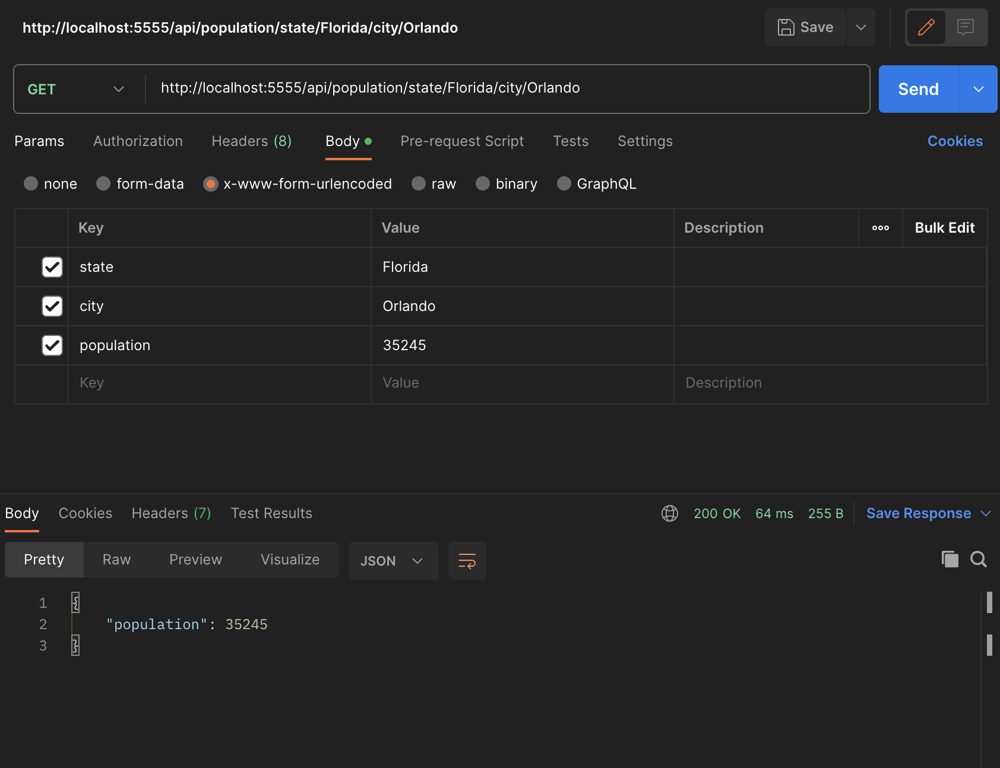
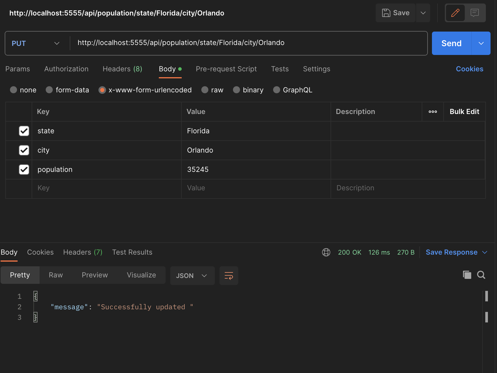

HOW TO USE:
 
 
OPTION 1: ONLY if given credential access

* RUN npm install
* Make a .env file to store the PORT, username and password credentials to connect to the database for MongoDB. The username and password will be part of the connection string to connect successfully to our database. See below for setup.

* Run npm start and start hitting the endpoints (I used postman for testing the routes). See below for visuals

 
 
OPTION 2:

* RUN npm install
* Make a .env file to store the PORT, username and password credentials to connect to your database for MongoDB which will be part of the connection string to connect successfully to our database. See below for setup.
* 
* Run node seed.js to store the data inside of our mongo database (there is 35918 objects so loading all these into the database may take a while).
* After there is 35918 objects stored in our database (you can hit refresh on the database to keep track of how many have been uploaded so far), hit ctrl c to exit this.
* Run npm start and start hitting the endpoints (I used postman for testing the routes). See below for visuals

